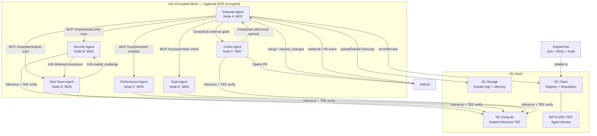
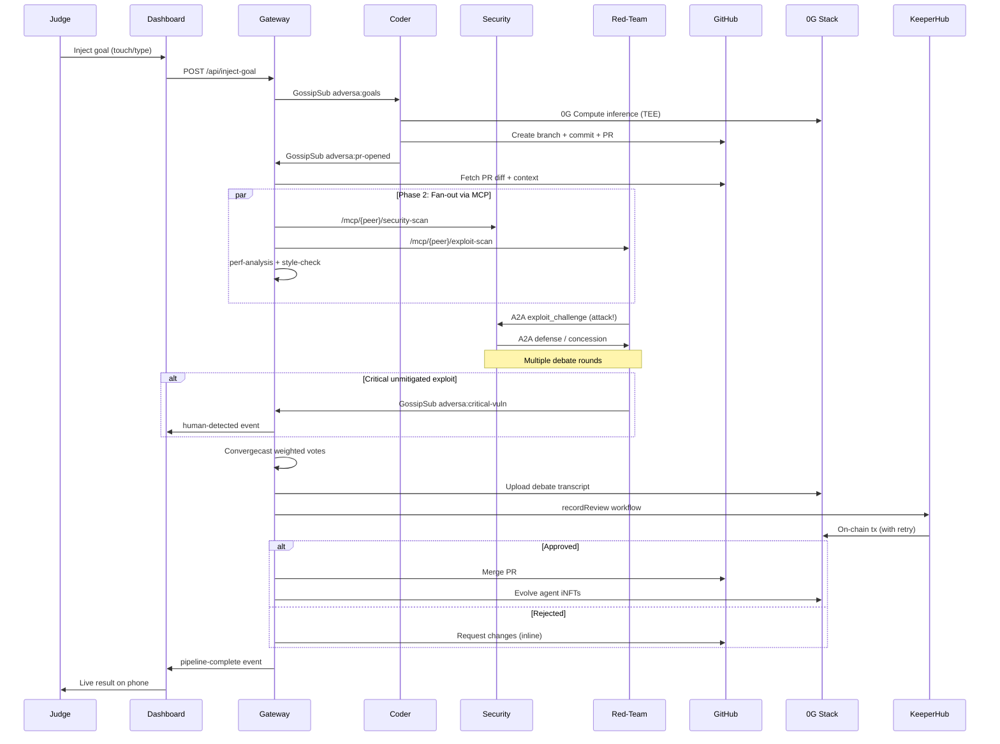
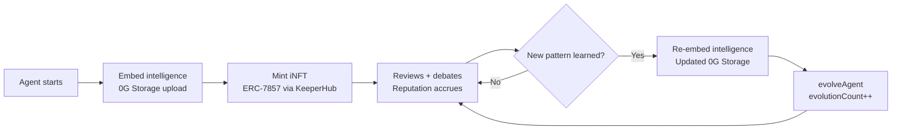

# ⚔ ADVERSA

**Adversarial AI code review swarm on AXL mesh with verifiable 0G inference and on-chain iNFT agents**

[](https://github.com/gensyn-ai/axl)
[](https://0g.ai)
[](https://keeperhub.io)

> 📹 Demo video: *coming soon*  
> 🌐 Live demo: *coming soon*

---

## The Problem

Code review is broken:
- **Confirmation bias**: reviewers approve what they understand and skip what they don't
- **Single-reviewer bottleneck**: one person can't catch security, performance, style, AND adversarial attack vectors simultaneously
- **No adversarial testing**: nobody simulates an attacker trying to exploit the code being reviewed
- **Centralized AI**: sending proprietary code to OpenAI/Anthropic means trusting a third party with your IP and getting unverifiable responses

## What ADVERSA Does

ADVERSA is a decentralized, peer-to-peer AI code review swarm where:

1. A **coder agent** receives a natural-language goal via GossipSub, writes code using 0G Compute's TEE-verified inference, and opens a GitHub PR
2. The **gateway agent** detects the PR (via webhook or gossip broadcast) and fans out review work to specialist agents via AXL's MCP routing
3. Three **reviewer agents** (security, performance, style) analyze the diff in parallel — each using 0G Sealed Inference, so every LLM response is cryptographically attested from TEE hardware
4. A **red-team agent** generates real exploit attempts (SQL injection payloads, auth bypass sequences, race condition triggers) and challenges the security agent via A2A structured debate
5. The **security agent** defends or concedes — if it concedes on a critical exploit, the red-team broadcasts an emergency alert via GossipSub to ALL nodes
6. A **consensus engine** aggregates weighted votes via AXL's convergecast — red-team findings weight 4x, security 3x, performance 2x, style 1x
7. The **gateway** auto-merges or requests changes on GitHub, records the review outcome on 0G Chain, stores the full debate transcript on 0G Storage, and evolves agent iNFTs when they learn new patterns
8. All on-chain transactions route through **KeeperHub** for gas optimization, retry logic, and audit trails

Every step works **offline** — AXL's Yggdrasil mesh routes agent-to-agent traffic over whatever local network exists. When internet returns, queued GitHub/0G/KeeperHub actions drain automatically.

---

## Architecture

### System Overview



### Review Pipeline Sequence



### AXL Feature Map

| AXL Feature | Where Used | Why Load-Bearing |
|---|---|---|
| Yggdrasil mesh + ed25519 | Every agent has a stable peer ID from its public key. All traffic encrypted at two layers. | Addressable, persistent agent identity. Source code never in plaintext. |
| `/mcp/{peer}/{service}` | Gateway fans out: `security-scan`, `perf-analysis`, `style-check`, `exploit-scan` | This is how work gets distributed. Remove it and the fan-out breaks. |
| `/a2a/{peer}` | Red-team sends `exploit_challenge`, security responds with `defense`/`concession` | The adversarial debate IS the product. Without A2A it's just a checklist. |
| `/send` + `/recv` | Heartbeats, progress signals, lightweight coordination | Keeps swarm synchronized without protocol overhead. |
| `/topology` | Gateway discovers online agents before fanning out. Gracefully skips offline agents. | Resilience when agents drop. No hardcoded peer lists. |
| GossipSub | Four topics: `adversa:pr-opened`, `adversa:critical-vuln`, `adversa:goals`, `adversa:human-activity` | Emergency broadcasts, event propagation, human-in-the-loop guardrails. |
| Convergecast | Aggregates weighted votes from all agents during consensus via the spanning tree | Efficient O(n) consensus instead of O(n²) message passing. |

### 0G Integration Map

| 0G Service | Usage | Details |
|---|---|---|
| 0G Compute (Sealed Inference) | Every LLM call from every agent | TEE-verified responses. `processResponse()` validates each inference. Proof stored with findings. |
| 0G Storage | Debate transcripts, review findings, agent intelligence blobs | Content-addressed via Merkle root. Root hash stored on 0G Chain. |
| 0G Chain — AdversaRegistry | Review outcomes (approved/rejected, confidence, exploits) | Immutable record of every ADVERSA review decision. |
| 0G Chain — AdversaReputation | Agent accuracy and exploit discovery rates | Reputation multiplier feeds back into consensus weights. |
| 0G Chain — AdversaINFT (ERC-7857) | Agent identity as on-chain NFT with embedded intelligence | `evolveAgent()` called when agents learn new patterns. |

### iNFT Lifecycle



---

## Tech Stack

| Layer | Technology | Version | Role |
|---|---|---|---|
| Language | TypeScript | 5.5+ | All agent code |
| Runtime | Node.js | 20+ | Agent processes |
| Package manager | pnpm | 9 | Dependency management |
| AXL mesh | Gensyn AXL | latest | P2P encrypted agent communication |
| LLM | 0G Compute | 0.2.5 | Sealed Inference (TEE-verified) |
| Storage | 0G Storage | 0.3.3 | Debate logs, agent memory |
| Chain | 0G Chain (16602) | - | Immutable review records |
| Smart contracts | Solidity | 0.8.19 | Registry, Reputation, iNFT |
| Contract tools | Hardhat + ethers.js v6 | 2.22 / 6.x | Compile, deploy, interact |
| Execution | KeeperHub MCP | latest | Gas, retry, nonce management |
| GitHub | Octokit REST | 20.x | PR creation, webhooks, merge |
| Dashboard | Express + Socket.IO | 4.x / 4.7 | Real-time event streaming |
| Containers | Docker Compose | 3.9 | Multi-node swarm deployment |

---

## Quick Start

### Prerequisites

- Node.js 20+, pnpm 9+
- Go 1.21+ (to build AXL binary)
- Docker + Docker Compose
- A GitHub account (for PR functionality)
- 0G testnet wallet with A0GI tokens ([faucet](https://hub.0g.ai/faucet))

### 1. Clone and install

```bash
git clone https://github.com/your-team/adversa
cd adversa
cp .env.example .env
pnpm install
```

### 2. Configure environment

Edit `.env`:
```env
# Required for AI inference
OG_PRIVATE_KEY=your_0g_wallet_private_key

# Required for GitHub PR functionality
GITHUB_TOKEN=ghp_your_github_personal_access_token
GITHUB_REPO_OWNER=your-org
GITHUB_REPO_NAME=your-repo

# Required for on-chain recording (fill after deploy step)
ADVERSA_REGISTRY_ADDRESS=
ADVERSA_REPUTATION_ADDRESS=
ADVERSA_INFT_ADDRESS=
```

### 3. Set up AXL nodes

```bash
pnpm setup
# Builds AXL binary, generates ed25519 keys, writes node configs
```

### 4. Deploy contracts

```bash
cd contracts && pnpm install
pnpm deploy              # Deploy to 0G Chain testnet
pnpm run mint-agents     # Mint 6 agent iNFTs
cd ..
```

### 5. Launch the swarm

**Option A — Docker (recommended for demo):**
```bash
docker-compose up --build
```

**Option B — Local processes:**
```bash
bash scripts/start-swarm.sh
```

### 6. Open dashboard

```
http://localhost:3001
```

On mobile: scan the QR code in the Control tab.

### 7. Run the demo

```bash
bash scripts/demo.sh
```

Or type a goal directly in the dashboard Control panel.

---

## AXL Integration Deep Dive

### Endpoint Usage

```typescript
// 1. MCP fan-out — gateway distributes review work
const findings = await axl.callMCP(
  securityPeer.peerId,
  'security-scan',     // service name
  'security-scan',     // method
  { diff, files, context }
);
// Calls: POST localhost:9002/mcp/{security_peer_id}/security-scan

// 2. A2A debate — red-team challenges security agent
const defense = await axl.callA2A(securityPeer.peerId, {
  type: 'a2a_call',
  payload: {
    type: 'exploit_challenge',
    exploit: { type: 'injection', payload: "' OR 1=1--", ... },
  }
});
// Calls: POST localhost:9002/a2a/{security_peer_id}

// 3. GossipSub — broadcast critical vulnerability to all nodes
await gossip.publish(GOSSIP_TOPICS.CRITICAL_VULN, {
  exploit, prHash, timestamp: Date.now()
});
// Calls: POST localhost:9002/gossip/publish

// 4. Topology — discover online agents before fan-out
const topo = await axl.getTopology();
const secPeers = topo.peers.filter(p => p.agentRole === 'security' && p.online);
// Calls: GET localhost:9002/topology

// 5. Convergecast — collect votes via spanning tree
const result = await axl.convergecast(
  `adversa:votes:${prHash}`,
  { votes },
  'collect'
);
// Calls: POST localhost:9002/convergecast
```

### Why Separate AXL Nodes Matter

Each agent runs its own AXL node with its own ed25519 key pair. This means:
- Agent identity = cryptographic key pair (not a config value)
- All inter-agent traffic encrypted by Yggdrasil before it leaves the process
- Even on the same machine, agents communicate as true peers, not in-process
- In production: each agent on a separate machine, no central coordinator

### Offline Mode

The entire review pipeline (fan-out, debate, consensus) runs on the AXL mesh with no internet. Only the final actions (GitHub merge, 0G Chain record, KeeperHub workflow) need internet. When offline:

```
AXL mesh review → consensus → APPROVED
  GitHub merge: queued to disk (data/offline-queue.json)
  0G Storage upload: queued
  0G Chain record: queued via KeeperHub
  → Dashboard: "Review complete. 3 actions queued."

[Internet restored]
  SyncEngine drains queue in order
  → Dashboard: "Syncing... 3→2→1→0. Sync complete!"
```

---

## 0G Integration Deep Dive

### Sealed Inference

Every agent's LLM call goes through 0G Compute:

```typescript
const broker = await createZGComputeNetworkBroker(wallet);
const services = await broker.inference.listService();
// Filter for TeeML verifiable providers

const headers = await broker.inference.getRequestHeaders(providerAddress, content);
const response = await fetch(`${endpoint}/chat/completions`, {
  method: 'POST',
  headers: { 'Content-Type': 'application/json', ...headers },
  body: JSON.stringify({ model, messages }),
});

// Verify TEE attestation — proves response came from genuine SGX/TDX hardware
const chatId = response.headers.get('ZG-Res-Key');
const isValid = await broker.inference.processResponse(providerAddress, chatId);
```

`isValid = true` means the response is cryptographically proven to have come from TEE hardware. We store `chatId` (the TEE proof) with every review finding.

### 0G Storage

```typescript
// Upload debate transcript
const { rootHash } = await storage.uploadDebateTranscript({
  prHash, messages: allDebates,
  participants: votes.map(v => v.agentPeerId),
  startTime, endTime,
});
// rootHash stored on-chain as the content-addressed receipt
```

### Contract Addresses (after deployment)

| Contract | Address | Explorer |
|---|---|---|
| AdversaRegistry | *fill after deploy* | [View](https://chainscan-galileo.0g.ai) |
| AdversaReputation | *fill after deploy* | [View](https://chainscan-galileo.0g.ai) |
| AdversaINFT | *fill after deploy* | [View](https://chainscan-galileo.0g.ai) |

### iNFT Proof

After `pnpm run mint-agents`, 6 agent iNFTs are minted on 0G Chain. Links appear in `contracts/deployments/minted-agents.json`.

---

## KeeperHub Integration Deep Dive

All on-chain operations route through KeeperHub:

```typescript
// Every registry write goes through KeeperHub for retry + gas management
const result = await keeperhub.recordReviewOnChain(
  consensus,        // Full ConsensusResult
  storageRoot,      // 0G Storage Merkle root
  registryAddress   // AdversaRegistry address
);
// KeeperHub handles: gas estimation, nonce management, multi-RPC failover,
// exponential backoff, and full execution audit trail
```

**Why KeeperHub vs raw ethers.js:**
- Six agents may trigger on-chain writes simultaneously — nonce collisions without coordination
- 0G Chain testnet can be congested — raw transactions fail silently
- Audit trail per workflow execution is valuable for the demo ("here is every tx ADVERSA has ever sent")
- See [FEEDBACK.md](./FEEDBACK.md) for honest integration experience

---

## Dashboard

The real-time dashboard runs at `http://localhost:3001` (or your machine's local IP for mobile access).

**Mobile access:** Scan the QR code in the Control tab. Phones on the same WiFi network can reach the dashboard at `http://192.168.x.x:3001`.

**Interactive features (designed for live judge demos):**
- **Inject Goal** — type a feature request, agents execute it live
- **Trigger Review** — paste a GitHub PR URL for immediate review
- **Advisory Vote** — cast approve/reject that feeds into consensus
- **Kill Internet** — demonstrates offline mesh operation
- **QR Code** — instant mobile access for audience participation

**Real-time events** (Socket.IO, no polling):
- Every MCP call, A2A message, GossipSub broadcast
- Live debate transcript (red attacks in red, green defenses in green)
- Weighted vote bars animating during consensus
- Queue draining animation when internet restores

---

## Demo Video Script

**0:00–0:10** — `docker-compose up`. Dashboard shows 6 nodes appearing on the AXL mesh topology. Yggdrasil encryption indicators on every connection.

**0:10–0:20** — QR code on screen. "Scan to participate." Judge scans on phone. Dashboard loads on mobile in real time.

**0:20–0:30** — Show minted agent iNFTs on 0G explorer. AgentCards show all 6 agents online with reputation scores.

**0:30–0:45** — Judge types on their **phone**: "Add rate limiting to the API endpoints." Goal broadcasts via GossipSub — animated pulse across mesh topology on both screens simultaneously.

**0:45–1:00** — Coder agent writes code via 0G Compute (TEE badge glows). PR appears on GitHub.

**1:00–1:15** — Three reviewers activate. ReviewPipeline stepper advances. MCP call lines animate across mesh.

**1:15–1:30** — Red-team finds exploit. DebateView shows red attack message. Security agent responds with green defense. Judge reads live adversarial debate on their phone.

**1:30–1:40** — ConsensusPanel animates — weighted bars growing in. Judge taps "Cast Advisory Vote" on phone. Vote appears on big screen.

**1:40–1:50** — APPROVED. Green banner. KeeperHub records on 0G Chain — tx hash link appears.

**1:50–2:00** — PR auto-merges. Agent iNFT evolution count increments on 0G explorer.

**2:00–2:10** — Judge taps "Kill Internet." Dashboard flashes orange: MESH ONLY.

**2:10–2:30** — New goal injected (offline). Full review pipeline runs on AXL mesh. Consensus reached. "3 actions queued."

**2:30–2:45** — Judge taps "Restore Internet." Queue drains: 3→2→1→0. GitHub merge, 0G tx, KeeperHub audit — all land.

**2:45–3:00** — Full stack summary. "Adversarial. Autonomous. Offline-first. ADVERSA."

---

## Team

| Name | Telegram | X |
|---|---|---|
| *Your name* | @handle | @handle |
| *Teammate* | @handle | @handle |

*Built for ETHGlobal OpenAgents — competing for Gensyn AXL, 0G Labs, and KeeperHub prizes.*
